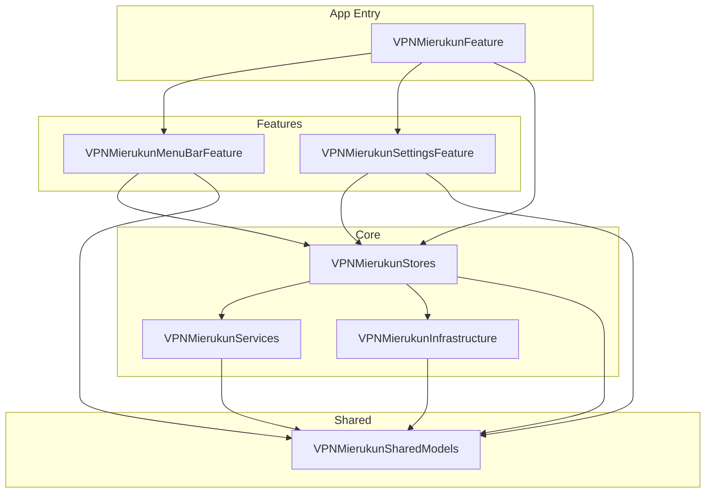

# VPN-Mierukun

[日本語](README.ja.md)

## Overview

VPN-Mierukun is a macOS app that visualizes VPN connection status with a screen-edge overlay.
It is designed to make it easy to notice whether your VPN is connected, disconnected, or in an unknown state without constantly checking a menu or settings window.

## Setup

- `open VPN-Mierukun.xcodeproj`
- If needed, run `xcodebuild -project VPN-Mierukun.xcodeproj -scheme VPN-Mierukun -destination 'platform=macOS' build`

## Distribution

- The app is distributed as a ZIP asset on GitHub Releases and installed through a Homebrew tap cask.
- Install example: `brew install --cask shsw228/tap/vpn-mierukun`
- Remove quarantine after installation: `xattr -dr com.apple.quarantine /Applications/VPN-Mierukun.app`
- You can generate release artifacts locally with `./scripts/homebrew/build-release-artifacts.sh <version> ./dist`
- See [docs/homebrew-tap.md](docs/homebrew-tap.md) for details

## Development Notes

- Target platform: macOS
- Intended UI: menu bar resident app + screen-edge overlay
- Keep the app target thin and place most implementation under `LocalPackage/Sources`
- The directory structure follows `AppEntry / Features / Core / Shared`
- See [docs/specification.md](docs/specification.md) for detailed requirements

## Documentation

- [docs/specification.md](docs/specification.md)
- [docs/design.md](docs/design.md)
- [docs/homebrew-tap.md](docs/homebrew-tap.md)

## Package Dependency Graph

