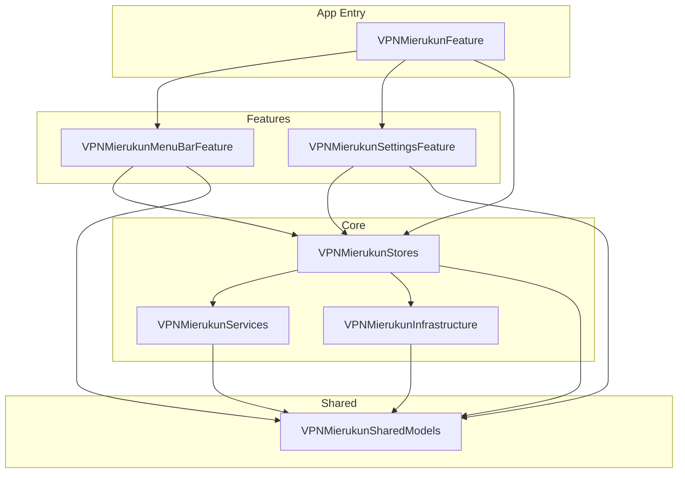

# VPN-Mierukun

## 概要
VPN の接続状況を macOS の画面周囲に表示するオーバーレイ色で可視化するアプリです。
常時画面を監視しなくても、接続中・未接続・判定不能の状態をひと目で把握できることを目指します。

## セットアップ
- `open VPN-Mierukun.xcodeproj`
- 必要に応じて `xcodebuild -project VPN-Mierukun.xcodeproj -scheme VPN-Mierukun -destination 'platform=macOS' build`

## 配布
- GitHub Releases に配布用 ZIP を公開し、Homebrew tap の `cask` からインストールする想定です
- インストール例: `brew install --cask shsw228/tap/vpn-mierukun`
- インストール後に quarantine を解除: `xattr -dr com.apple.quarantine /Applications/VPN-Mierukun.app`
- リリース用 artifact は `./scripts/homebrew/build-release-artifacts.sh <version> ./dist` でローカル生成できます
- 詳細は [docs/homebrew-tap.md](docs/homebrew-tap.md) を参照

## 開発メモ
- 想定プラットフォーム: macOS
- 想定 UI: メニューバー常駐 + 画面端オーバーレイ
- app target は薄く保ち、実装本体は `LocalPackage/Sources` に配置
- ディレクトリ構成は `AppEntry / Features / Core / Shared` を基準にする
- 詳細仕様は [docs/specification.md](docs/specification.md) を参照

## ドキュメント
- [docs/specification.md](docs/specification.md)
- [docs/design.md](docs/design.md)
- [docs/homebrew-tap.md](docs/homebrew-tap.md)

## Package 依存グラフ

