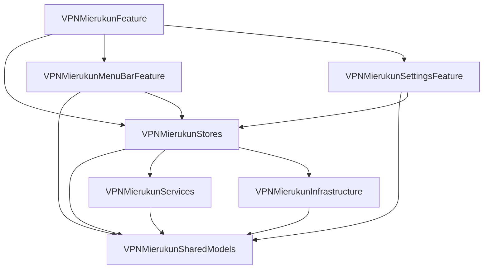

# VPN-Mierukun

## 概要
VPN の接続状況を macOS の画面周囲に表示するオーバーレイ色で可視化するアプリです。
常時画面を監視しなくても、接続中・未接続・判定不能の状態をひと目で把握できることを目指します。

## セットアップ
- `xcodegen generate`
- `open VPN-Mierukun.xcodeproj`
- 必要に応じて `xcodebuild -project VPN-Mierukun.xcodeproj -scheme VPN-Mierukun -destination 'platform=macOS' build`

## 開発メモ
- 想定プラットフォーム: macOS
- 想定 UI: メニューバー常駐 + 画面端オーバーレイ
- app target は薄く保ち、実装本体は `LocalPackage/Sources/VPNMierukunFeature` に配置
- 詳細仕様は [docs/specification.md](docs/specification.md) を参照

## ドキュメント
- [docs/specification.md](docs/specification.md)
- [docs/design.md](docs/design.md)

## Package 依存グラフ

